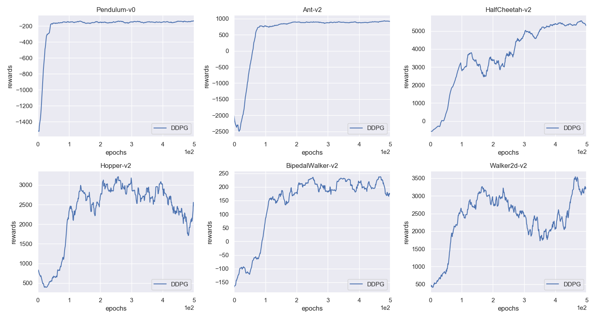

# Deep Deterministic Policy Gradient (DDPG)
## Instructions
1. Train the agents (GPU is not supported, will support it in the future):
```bash
mpirun -np 1 python -u train.py --env-name='<env name>' --<other-flags> 2>&1 | tee exp_ddpg.log
```
2. Play the demo:
```bash
python demo.py --env-name='<env name>'
```
## Results

